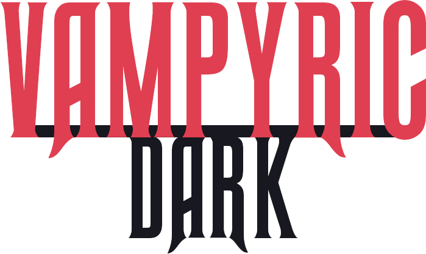

Vampyric Dark is a Dracula-based theme that aims to provide a specification and more consistency for Graphical User Interfaces.

## Color Palette

| Palette                       | Hex       | RGB             | HSL              |  |
| ----------------------------- | --------- | --------------- | ---------------- | ------------------------------------------------------------------------------------- |
| Light Background/Accent Color | `#383a59` | `56, 58, 89`    | `236, 23%, 28%`  |                                                        |
| Light Focused Background      | `#2d2f4d` | `45, 47, 77`    | `236, 26%, 24%`  |                                            |
| Dark Background               | `#171820` | `23, 24, 32`    | `233, 16%, 11%`  |                                                     |
| Dark Focused Background       | `#1e202b` | `30, 32, 43`    | `231, 18%, 14%`  |                                             |
| Foreground                    | `#f8f8f2` | `248, 248, 242` | `60°, 30%, 96%`  |                                                          |
| Title Foreground/Purple       | `#bd93f9` | `189, 147, 249` | `265°, 89%, 78%` |                                                    |
| Link Foreground/Blue          | `#6272a4` | `139, 233, 253` | `191°, 97%, 77%` |                                                     |
| Empty/Not Loaded/Grey         | `#b3b4b6` | `179, 180, 182` | `220, 2%, 71%`   |                                                                |
| Warning/Red                   | `#e03f52` | `224, 63, 82`   | `353, 72%, 56%`  |                                                                 |

## FAQ

###### "Are you going to create a light color scheme?"

Eventually, yes!

###### "Are you going to have a syntax highlighting spec?"

Nope. This is a GUI theme. Dracula already does that well and Vampyric Dark fits well with it so there's no need for duplication.

###### "How do I submit a new theme?"

The project is fairly new, so we're currenly aggregating links only. Make your theme and make an issue and we'll link it. When we have a decent sized catalog of themes we'll make an organization.

## Team

Vampyric Dark is a project created by [Raph](https://github.com/RaphGL/)

## Credits

- Color palette inspired by [@zenorocha's Dracula Dark Theme](http://draculatheme.com/)

## License

[AGPLv3](./LICENSE) © Vampyric Dark
